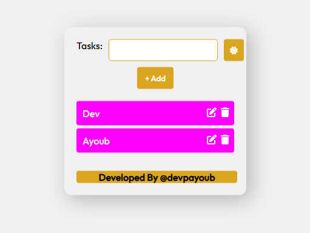
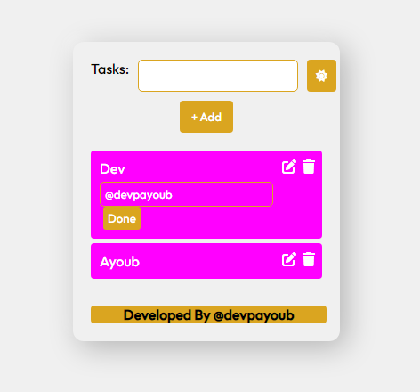
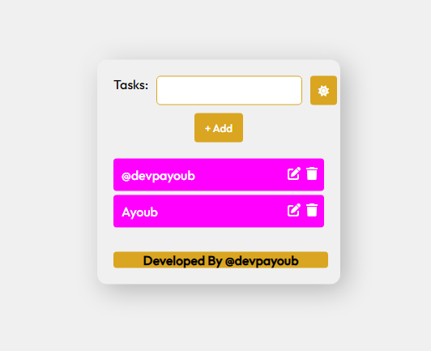

<div align="center">
  
  
  
  <br />
  <br />

  <h2 align="center">To Do List</h2>

  To Do List ,<br />  will be able to add new tasks to be done, delete tasks, mark tasks after completion, we will have a drop-down menu to filter our tasks on basis of completed or incomplete tasks.
    <br /><a href="https://certificate-generator.celebritytravel.net/list/"><strong>➥ Live Demo</strong></a>

</div>

<br />

## Demo Screeshots
### To Do List



### To Do List



### To Do List



### Prerequistes

<p>
  Basics of HTML, CSS and JS (specially DOM Manipulations)</br>
</br>
</p>

### Contact

If you want to contact with me you can reach me at [Facebook](https://www.facebook.com/EminemTB).

## Credits :
```
This Script is free to distribute, modify and use with the condition that credit is provided to the creator (@devpayoub) and is not for commercial use.
Email : trabelsi.ayoub1998@gmail.com
```
